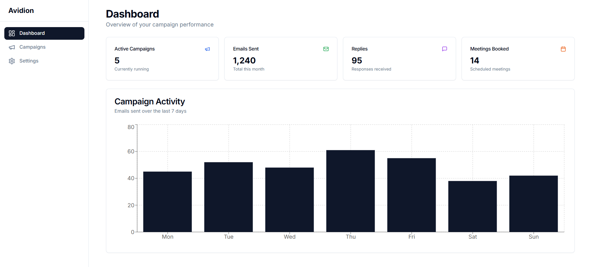
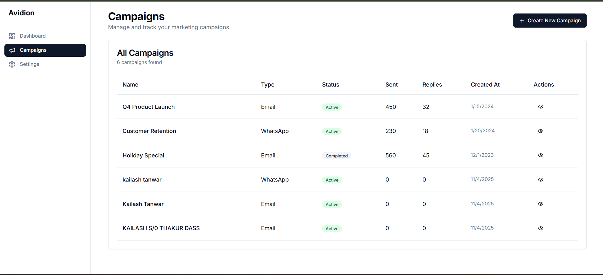
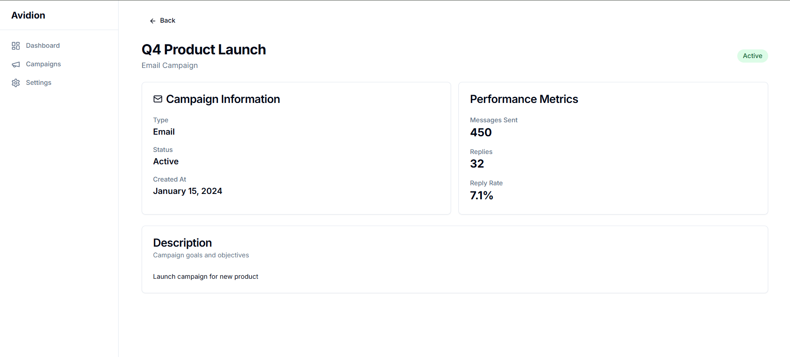
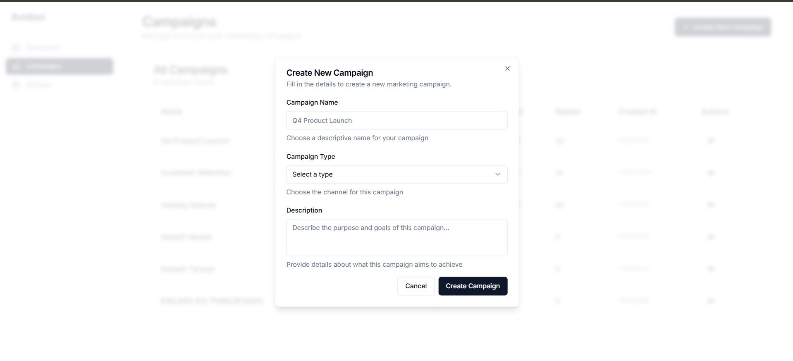
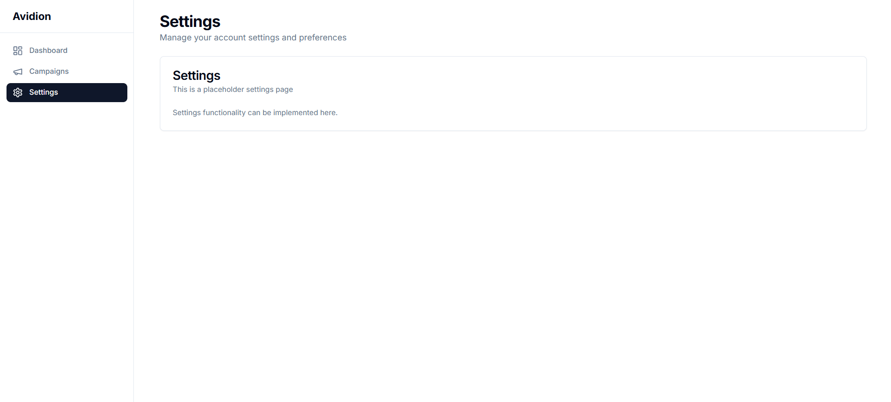

# Avidion Campaign Manager

A full-stack Mini Campaign Manager built with Next.js, TypeScript, TailwindCSS, shadcn/ui, and Express.js.

## Features

### Frontend (Section A - Core Task)
- ✅ **Dashboard Screen**: Summary cards, charts, and sidebar navigation
- ✅ **Campaign List Screen**: Table view with campaign management
- ✅ **Create Campaign Screen**: Form with validation (React Hook Form + Zod)
- ✅ **Responsive Design**: Works on desktop, tablet, and mobile
- ✅ **TypeScript Safety**: Fully typed application
- ✅ **Clean Code Structure**: Well-organized components and layouts

### Backend (Section B - Backend Integration)
- ✅ **Express.js API**: RESTful API with GET/POST endpoints
- ✅ **Data Persistence**: JSON file storage
- ✅ **CORS Support**: Configured for frontend communication
- ✅ **Error Handling**: Proper validation and error messages

### Bonus (Section C - Creative Task)
- ✅ **Landing Page Hero Section**: Beautiful animated hero with smooth scroll

## Screenshots

### Dashboard












## Tech Stack

- **Frontend**: Next.js 14, TypeScript, TailwindCSS, shadcn/ui
- **Backend**: Express.js, Node.js
- **Form Validation**: React Hook Form + Zod
- **Charts**: Recharts
- **Animations**: Framer Motion
- **HTTP Client**: Axios

## Getting Started

### Prerequisites

- Node.js 18+ installed
- npm or yarn package manager

### Installation

1. Install dependencies:
```bash
npm install
```

2. Install backend dependencies:
```bash
cd backend
npm install
cd ..
```

3. Start the backend server (in one terminal):
```bash
npm run server
```

Or from the backend directory:
```bash
cd backend
npm start
```

The backend will run on `http://localhost:3001`

4. Start the Next.js development server (in another terminal):
```bash
npm run dev
```

The frontend will run on `http://localhost:3000`

### Usage

1. **Dashboard**: Visit `http://localhost:3000` to see the dashboard with summary cards and charts
2. **Campaigns**: Navigate to `/campaigns` to view and manage campaigns
3. **Create Campaign**: Click "Create New Campaign" button to open the form modal
4. **Campaign Details**: Click the eye icon to view campaign details
5. **Landing Page**: Visit `/landing` to see the animated hero section

## Project Structure

```
├── app/                    # Next.js app directory
│   ├── campaigns/         # Campaign pages
│   ├── landing/           # Landing page
│   ├── settings/          # Settings page
│   ├── layout.tsx         # Root layout
│   ├── page.tsx           # Dashboard page
│   └── globals.css        # Global styles
├── components/            # React components
│   ├── ui/               # shadcn/ui components
│   ├── dashboard.tsx     # Dashboard component
│   ├── campaign-list.tsx # Campaign list component
│   ├── sidebar.tsx       # Sidebar navigation
│   └── ...
├── backend/              # Standalone Express.js backend
│   ├── src/
│   │   ├── routes/       # API routes
│   │   ├── controllers/  # Request handlers
│   │   ├── services/     # Business logic
│   │   ├── repositories/ # Data access layer
│   │   └── utils/        # Utility functions
│   ├── data/             # JSON data storage (auto-created)
│   ├── server.js         # Application entry point
│   └── package.json      # Backend dependencies
├── lib/                  # Utility functions
└── package.json          # Dependencies
```

## API Endpoints

- `GET /api/campaigns` - Get all campaigns
- `GET /api/campaigns/:id` - Get a specific campaign
- `POST /api/campaigns` - Create a new campaign
- `PUT /api/campaigns/:id` - Update a campaign
- `DELETE /api/campaigns/:id` - Delete a campaign
- `GET /api/health` - Health check

## Features in Detail

### Dashboard
- 4 summary cards showing key metrics
- Interactive bar chart using Recharts
- Responsive grid layout

### Campaign Management
- Table view with sorting and filtering capabilities
- Create new campaigns with validated form
- View campaign details with performance metrics
- Status indicators with color coding

### Form Validation
- React Hook Form for form state management
- Zod schema validation
- Real-time error messages
- Success toast notifications

### Landing Page
- Animated gradient background
- Smooth scroll transitions
- Feature highlights
- Call-to-action buttons

## Development

### Building for Production

```bash
npm run build
npm start
```

### Linting

```bash
npm run lint
```

## Notes

- The backend is completely separate from Next.js and runs independently
- Backend stores data in `backend/data/campaigns.json` (auto-created)
- CORS is enabled for local development
- The app includes fallback data if the backend is unavailable
- All components are fully responsive and accessible
- Backend follows MVC architecture (Routes → Controllers → Services → Repositories)

## License

This project is built for evaluation purposes.

